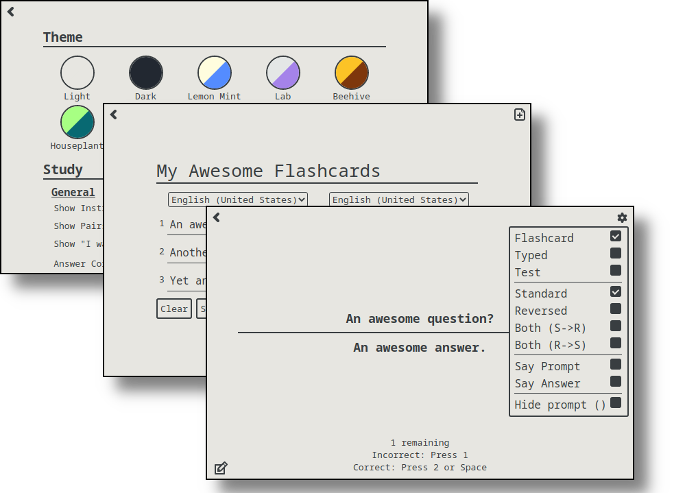

<a name="readme-top"></a>

<!--
*** Created using the Best-README-Template. https://github.com/othneildrew/Best-README-Template
-->

<!-- PROJECT SHIELDS -->
<!--
*** I'm using markdown "reference style" links for readability.
*** Reference links are enclosed in brackets [ ] instead of parentheses ( ).
*** See the bottom of this document for the declaration of the reference variables
*** for contributors-url, forks-url, etc. This is an optional, concise syntax you may use.
*** https://www.markdownguide.org/basic-syntax/#reference-style-links
-->
<div align="center">

[![Contributors][contributors-shield]][contributors-url]
[![Forks][forks-shield]][forks-url]
[![Stargazers][stars-shield]][stars-url]
[![Issues][issues-shield]][issues-url]
[![LICENSE][license-shield]][license-url]

</div>

<!-- PROJECT LOGO -->
<br />
<div align="center">
  <a href="https://flashbang.lol/">
    
  </a>

  <h3 align="center">flashbang</h3>

  <p align="center">
    <strong>a free and open source flashcard app</strong>
    <br />
    <br />
    Available for Windows, macOS, and Linux
  </p>
</div>

<!-- TABLE OF CONTENTS -->
<details>
  <summary>Table of Contents</summary>
  <ol>
    <li>
      <a href="#about-the-project">About The Project</a>
    </li>
    <li><a href="#installation">Installation</a></li>
    <li>
      <a href="#getting-started">Getting Started</a>
      <ul>
        <li><a href="#prerequisites">Prerequisites</a></li>
        <li><a href="#building">Building</a></li>
      </ul>
    </li>
    <li><a href="#usage">Usage</a></li>
    <li><a href="#contributing">Contributing</a></li>
    <li><a href="#license">License</a></li>
  </ol>
</details>

<!-- ABOUT THE PROJECT -->

## About The Project



Some Features Include:

-   Minimalistic Flashcard Reviewing
-   Typing and Test Modes for Flashcard sets
-   Easy Importing
-   Speech Synthesis

More features and screenshots can be found <a href="https://flashbang.lol/features.html">here</a>.

## Installation

Simply download Flashbang for your operating system from the <a href="https://flashbang.lol/">official site</a>.

<!-- GETTING STARTED -->

## Getting Started

To get a local copy up and running follow these simple example steps.

### Prerequisites

Install npm and download this repository to proceed. This is dependent on your operating system.

Once npm is installed, run the following command in the directory of the project to download all of the dependencies.

-   npm
    ```sh
    npm install
    ```

### Building

#### Windows

To build, run the following commands depending on your architecture

win64:
`npm run package-win64`

win32:
`npm run package-win32`

win64arm:
`npm run package-win64arm`

#### macOS

To build, run the following command:
`npm run package-mac`

To notarize and package as .dmg after build, input bundle ID, Apple ID, and app specific password into notarize.json. Then change appId and provisioningProfile values under build in package.json and run: `npm run dist`

#### Linux

To build, run the following command:
`npm run package-linux`

To package as .deb after build, run:
`electron-installer-debian --src release-builds/flashbang-linux-x64/ --arch amd64 --config debian.json`

<!-- USAGE EXAMPLES -->

## Usage

### Creating a bunch of Flashcards

Simply click the plus icon in the upper left to create a new bunch.


### Editing an existing bunch

Simply click the pencil icon in the lower left to enable editing mode.


### Importing

Navigate to the new bunch menu using the  icon. Then click the  icon in the top right corner. Once in the import menu, paste the data you want to import, provide the appropriate separators, and click "Import".

<!-- CONTRIBUTING -->

## Contributing

Contributions are what make the open source community such an amazing place to learn, inspire, and create. Any contributions you make are **greatly appreciated**.

If you have a suggestion that would make this better, please fork the repo and create a pull request. You can also simply open an issue with the tag "enhancement".
Don't forget to give the project a star! Thanks again!

1. Fork the Project
2. Create your Feature Branch (`git checkout -b feature/AmazingFeature`)
3. Commit your Changes (`git commit -m 'Add some AmazingFeature'`)
4. Push to the Branch (`git push origin feature/AmazingFeature`)
5. Open a Pull Request

<!-- LICENSE -->

## License

Distributed under the GPL-3.0 licence. See `LICENSE` for more information.

<!-- MARKDOWN LINKS & IMAGES -->
<!-- https://www.markdownguide.org/basic-syntax/#reference-style-links -->

[contributors-shield]: https://img.shields.io/github/contributors/taylor-hartman/Flashbang.svg?style=for-the-badge
[contributors-url]: https://github.com/taylor-hartman/Flashbang/graphs/contributors
[forks-shield]: https://img.shields.io/github/forks/taylor-hartman/Flashbang.svg?style=for-the-badge
[forks-url]: https://github.com/taylor-hartman/Flashbang/network/members
[stars-shield]: https://img.shields.io/github/stars/taylor-hartman/Flashbang.svg?style=for-the-badge
[stars-url]: https://github.com/taylor-hartman/Flashbang/stargazers
[issues-shield]: https://img.shields.io/github/issues/taylor-hartman/Flashbang.svg?style=for-the-badge
[issues-url]: https://github.com/taylor-hartman/Flashbang/issues
[license-shield]: https://img.shields.io/github/license/taylor-hartman/Flashbang.svg?style=for-the-badge
[license-url]: https://github.com/taylor-hartman/Flashbang/blob/master/LICENSE.txt
